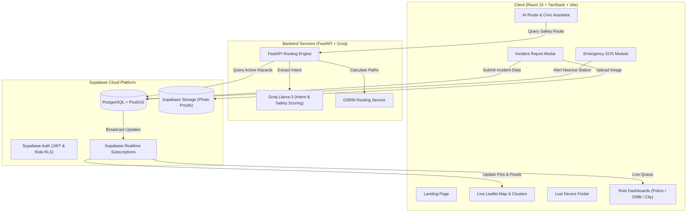

<div align="center">

# 🏆 Nirapod Dhaka (নিরাপদ ঢাকা)

### 🥇 **HACKATHON CHAMPION — 1ST PLACE WINNING PROJECT** 🥇

[](#-hackathon-victory--recognition)
[](https://nirapoddhk.vercel.app)
[](https://react.dev/)
[](https://www.typescriptlang.org/)
[](https://vitejs.dev/)
[](https://tailwindcss.com/)
[](https://supabase.com/)
[](https://groq.com/)
[](https://leafletjs.com/)

<br/>

> **"An award-winning civic safety and emergency response ecosystem engineered to empower 20+ million citizens of Dhaka with real-time hazard reporting, AI-powered safe routing, instant emergency SOS dispatch, and automated multi-agency governance."**

<br/>

**🔗 Live App**: [**https://nirapoddhk.vercel.app**](https://nirapoddhk.vercel.app) &nbsp;|&nbsp; **🌐 Domain**: `nirapoddhk.vercel.app`

</div>

---

> [!IMPORTANT]
> ### 🏆 Hackathon Victory & Recognition
> **Nirapod Dhaka emerged as the Champion (1st Place Winner)** in the hackathon competition! Recognized by the judges and community for its real-world impact, technical excellence, robust multi-agency auto-triage architecture, and intuitive accessibility for everyday commuters across Bangladesh.

---

## 📖 Table of Contents

- [🏆 Hackathon Victory & Recognition](#-hackathon-victory--recognition)
- [Overview & Mission](#-overview--mission)
- [Key Features](#-key-features)
- [Authority Dashboards & Demo Credentials](#-authority-dashboards--demo-credentials)
- [Architecture & Data Flow](#-architecture--data-flow)
- [Technology Stack](#-technology-stack)
- [Database Schema](#-database-schema)
- [AI Safe Routing & Chatbot Engine](#-ai-safe-routing--chatbot-engine)
- [Getting Started & Local Development](#-getting-started--local-development)
- [Environment Configuration](#-environment-configuration)
- [Project Directory Structure](#-project-directory-structure)
- [Deployment](#-deployment)
- [Accessibility & Design Philosophy](#-accessibility--design-philosophy)
- [Contributing & License](#-contributing--license)

---

## 🏆 Hackathon Victory & Recognition

> **Nirapod Dhaka was built as a full-stack working MVP during the Hackathon and was crowned the 1st Place Champion! 🥇**

### 🌟 What Made Nirapod Dhaka the Winning Solution:
- 💡 **Real-World Civic Impact**: Directly tackles urgent daily hazards in Dhaka — open manholes, damaged drainage, dark crime-prone alleys, waterlogging, and traffic emergencies.
- ⚡ **Automated Multi-Agency Triaging**: Eliminates manual bureaucratic bottlenecks by routing reports directly to the specific authority (**Bangladesh Police**, **Disaster Management Bureau**, or **Dhaka City Corporation**) based on incident classification.
- 🧠 **AI-Powered Safe Routing**: Integrates Groq LLMs with OpenStreetMap (OSRM) candidate routes and active hazard database scoring to compute the safest walking/driving paths avoiding active crime hotspots.
- 🆘 **Zero-Friction Emergency Tools**: Includes a one-tap live GPS SOS broadcaster and a no-login public lost-phone tracker.
- ♿ **Community & Mobile-First Accessibility**: Light-mode civic aesthetic, bilingual English/বাংলা support, and thumb-friendly tap targets for rapid single-handed reporting on the go.

---

## 🎯 Overview & Mission

**Nirapod Dhaka** is a full-stack, mobile-first civic safety and emergency response web application engineered specifically for the urban challenges of Dhaka, Bangladesh.

Everyday commuters and citizens can report safety hazards (broken roads, open manholes, waterlogging, illegal dumping), crime occurrences (snatching, harassment, theft), and traffic accidents on an interactive, real-time map with GPS coordinates and photo evidence. Reports are automatically triaged and dispatched without bureaucratic friction to the respective municipal and law-enforcement authorities: **Bangladesh Police**, **Disaster Management Bureau (DMB)**, and **Dhaka City Corporation**.

---

## ✨ Key Features

### 1. 🗺️ Interactive Live Hazard & Hotspot Map
- **Dynamic Leaflet & OSM Integration**: Fast map rendering with custom color-coded category markers (Red for Crime, Amber for Infrastructure, Teal for Accidents).
- **Marker Clustering**: Automatically groups dense regional reports into numbered cluster bubbles for smooth zoom navigation.
- **Crime & Hazard Hotzones**: Automated heatmap overlays highlighting zones with high frequencies of incident reports within 48-hour windows.
- **Recent Pulse Effect**: Visual pulsing animations on newly submitted reports (within the last hour) to convey live situational awareness.

### 2. 🚨 Instant Citizen Reporting with Auto-Routing
- **Draggable GPS Pin Locator**: Pinpoint exact location coordinates automatically using browser Geolocation API or manual map pin dragging.
- **Photo Evidence Upload**: Integrated Supabase Storage bucket for verifiable visual proof.
- **Zero-Friction Auto-Triage**:
  - *Infrastructure hazards* (manhole, road defect, waterlogging) $\rightarrow$ Dispatched to **City Corporation** & **DMB**.
  - *Crime & safety incidents* (mugging, harassment, eve-teasing) $\rightarrow$ Dispatched to **Bangladesh Police** & **City Corporation**.
  - *Traffic Accidents* $\rightarrow$ Triggers the emergency medical and hospital dispatch workflow.

### 3. 🆘 One-Tap Emergency SOS System
- **Quick-Access Persistent Trigger**: Thumb-accessible floating SOS trigger available across all views.
- **Accidental Trigger Prevention**: Confirmation modal with live GPS coordinates broadcast.
- **Immediate Authority & Contact Dispatch**: Automatically calculates and alerts the nearest police station (using PostGIS/spatial distance) and notifies designated in-app emergency contacts.

### 4. 📱 Zero-Login "Lost Phone" Geolocation Finder
- Accessible publicly from the landing page without requiring account login (ideal for users borrowing a stranger's phone).
- Generates a unique, secure trackable link mapped to the device's phone number.
- Allows real-time geolocation view of the device on an emergency tracking map.

### 5. 🚑 Emergency Medical & Hospital Bed Tracker
- When an accident is logged or emergency assistance is requested, the system displays the nearest hospitals (e.g., Dhaka Medical College Hospital, Square Hospital, United Hospital).
- Visual status indicators for **general bed availability** and **ICU availability** (Green = Available, Red = Full) for rapid decision-making under stress.
- One-tap quick emergency calling.

### 6. 🤖 AI Safe Route Navigator & Civic Chatbot (Groq LLM + OSRM)
- **Safe Route Planning**: Custom routing algorithm that queries OpenStreetMap (OSRM) candidate paths and penalizes routes passing near reported crime hotspots or hazardous infrastructure.
- **Civic Safety Assistant**: Conversational AI powered by Groq (Llama-3 / Mixtral) to answer municipal safety queries, emergency protocols, and route safety assessments.

### 7. 👥 Community Verification & Voting
- Prevents spam and false reporting through community upvoting (`confirm`) and dispute voting (`dispute`).
- Real-time vote tallies displayed directly inside the report bottom-sheet.

---

## 🏛️ Authority Dashboards & Demo Credentials

Each authority role is directed to a specialized operations dashboard upon authentication:

| Role | Target Entity | Primary Capabilities | Demo Login | Demo Password |
| :--- | :--- | :--- | :--- | :--- |
| **Police** | 👮 Bangladesh Police HQ | Live SOS alert feeds, crime hotzones, dispatch management, status resolution | `police@nirapod.com` | `police1234` |
| **DMB** | 🏗️ Disaster Management Bureau | Infrastructure incidents (open manholes, damaged drains, floods), severity filters | `disaster@nirapod.com` | `disaster1234` |
| **City Corporation** | 🏛️ Dhaka City Corporation Admin | Comprehensive city overview, cross-agency oversight, analytics charts, status override | `city@nirapod.com` | `city1234` |
| **Citizen** | 👤 Everyday Commuter | Incident reporting, live map navigation, personal report tracker, SOS, lost phone finder | Register with any email | User Defined |

---

## 🏗️ Architecture & Data Flow



---

## 💻 Technology Stack

### Frontend
- **Framework**: React 19 + TanStack Router / TanStack Start
- **Build Tool**: Vite 8 with TypeScript 5.8
- **Styling**: Tailwind CSS v4 + Radix UI primitives (`shadcn/ui` components)
- **Map & Geospatial**: Leaflet.js, React-Leaflet, Leaflet.markercluster
- **Icons & Visuals**: Lucide React, Embla Carousel, Recharts (Analytics), Sonner (Toasts)
- **Form Management**: React Hook Form, Zod schema validation

### Backend & Cloud Infrastructure
- **BaaS**: Supabase (PostgreSQL, Auth, Storage, Edge Functions, Row-Level Security)
- **Geospatial Engine**: PostGIS spatial queries for distance calculation & hotspot clustering
- **Microservices Backend**: Python 3.11 + FastAPI + Uvicorn
- **AI / LLM Engine**: Groq API (High-throughput inference for safety route scoring and intent parsing)

---

## 🗄️ Database Schema

The PostgreSQL database is organized with strict Row Level Security (RLS) policies:

- **`profiles`**: User metadata, role classification (`citizen`, `police`, `dmb`, `city_corp`), and emergency contact information.
- **`reports`**: Incident details including `type` (`crime`, `infrastructure`, `accident`), `subtype`, coordinates (`lat`, `lng`), `photo_url`, `description`, and lifecycle status (`sent`, `received`, `resolved`).
- **`report_votes`**: Community verification records (`confirm` vs `dispute`).
- **`sos_alerts`**: Emergency triggers with real-time tracking coordinates, user ID, timestamp, and linked `nearest_station_id`.
- **`police_stations`**: Pre-seeded coordinates and metadata for police stations across Dhaka metropolitan areas.
- **`hospitals`**: Pre-seeded emergency healthcare facilities with live bed and ICU availability statuses.

---

## 🚀 Getting Started & Local Development

### Prerequisites
- **Node.js**: `v20.x` or higher
- **npm** or **bun**: `npm` v10+ or `bun` v1.1+
- **Python** *(Optional, for AI Route microservice)*: `Python 3.10+`

### 1. Clone the Repository
```bash
git clone https://github.com/zubairprince111/Nirapod-Dhaka.git
cd Nirapod-Dhaka
```

### 2. Install Frontend Dependencies
```bash
npm install
```

### 3. Configure Environment Variables
Copy `.env.example` to `.env`:
```bash
cp .env.example .env
```
Fill in your Supabase and Groq credentials in `.env` (see [Environment Configuration](#-environment-configuration)).

### 4. Start the Frontend Development Server
```bash
npm run dev
```
Open your browser at `http://localhost:5173`.

### 5. (Optional) Run the Python AI Safe Route Service
```bash
cd backend
python -m venv venv
# On Windows:
.\venv\Scripts\activate
# On Linux/macOS:
source venv/bin/activate

pip install -r requirements.txt # fastapi uvicorn pydantic python-dotenv httpx
python main.py
```
The FastAPI microservice will start on `http://localhost:8000`.

### 6. (Optional) Seed Admin & Authority Accounts
To initialize or refresh the demo authority accounts in your Supabase database:
```bash
node seed-admin.mjs
```

---

## ⚙️ Environment Configuration

Create a `.env` file in the root directory:

```env
# Supabase Configuration
VITE_SUPABASE_URL="https://your-project.supabase.co"
VITE_SUPABASE_PUBLISHABLE_KEY="your-anon-key"
SUPABASE_URL="https://your-project.supabase.co"
SUPABASE_PUBLISHABLE_KEY="your-anon-key"
SUPABASE_PROJECT_ID="your-project-id"

# Groq AI Service (For Safe Routing and Civic Chatbot)
VITE_GROQ_API_KEY="gsk_your_groq_api_key"
GROQ_API_KEY="gsk_your_groq_api_key"
```

---

## 📁 Project Directory Structure

```text
Nirapod-Dhaka/
├── backend/                  # Python FastAPI AI Routing Microservice
│   ├── config.py             # Backend configuration and environment loading
│   ├── main.py               # FastAPI application endpoints
│   └── services/
│       ├── llm.py            # Groq LLM prompt generation & intent parser
│       ├── routing.py        # OSRM routing client & geocoding
│       └── scoring.py        # Safety penalty and route risk scoring
├── public/                   # Static assets, institutional badges, favicons
│   ├── citycorporation.png
│   ├── disaster.png
│   ├── police.png
│   └── hero_civic_illustration.png
├── src/
│   ├── components/           # React UI and feature components
│   │   ├── dashboard/        # Police, DMB, and City Corp dashboards
│   │   ├── map/              # Leaflet map canvas, markers, and chat panel
│   │   └── ui/               # Radix UI / shadcn design system primitives
│   ├── hooks/                # Custom React hooks (e.g., use-dashboard-data)
│   ├── integrations/         # Supabase client, middleware, and type bindings
│   ├── lib/                  # Utilities, geo algorithms, Groq client, auth state
│   ├── routes/               # TanStack routing definitions
│   │   ├── __root.tsx        # Application root layout & navigation chrome
│   │   ├── index.tsx         # Landing page with live map teaser
│   │   ├── auth.tsx          # Sign-in & Sign-up page with role dispatcher
│   │   ├── map.tsx           # Fullscreen live interactive citizen map
│   │   ├── dashboard.tsx     # Role-protected authority dashboard wrapper
│   │   ├── lost-phone.tsx    # Standalone lost device locator
│   │   ├── locate.$token.tsx # Real-time emergency token map tracking
│   │   └── profile.tsx       # User profile, emergency contacts & report history
│   └── styles.css            # Tailwind CSS design system rules
├── supabase/
│   └── migrations/           # PostgreSQL schemas, RLS policies, PostGIS functions
├── seed-admin.mjs            # Automated seed script for authority accounts
├── package.json              # Project dependencies and npm scripts
├── tsconfig.json             # TypeScript configuration
└── vite.config.ts            # Vite bundler configuration
```

---

## 🎨 Accessibility & Design Philosophy

- **Light Mode Civic Aesthetic**: Clean, high-contrast, official civic palette (`#F4F6F5` background, `#1A1D1E` charcoal ink, `#0E9C8C` trust teal).
- **Icon + Label Navigation**: Every interactive element combines intuitive iconography with clear descriptive text for low-literacy users.
- **Bilingual Interface**: Seamless one-tap toggle between **Bangla (বাংলা)** and **English** with optimized Bengali typography.
- **Ergonomic Tap Targets**: Minimum 44px touch targets optimized for single-handed mobile usage on busy Dhaka streets.

---

## 🚢 Deployment

The frontend is configured for deployment on **Vercel** with zero configuration required:

1. Push your repository to GitHub (`main` branch).
2. Import the repository into [Vercel](https://vercel.com).
3. Add the required environment variables (`VITE_SUPABASE_URL`, `VITE_SUPABASE_PUBLISHABLE_KEY`, `VITE_GROQ_API_KEY`).
4. Click **Deploy**.

---

## 🤝 Contributing

Contributions are welcome! If you would like to contribute:
1. Fork the repository.
2. Create a feature branch (`git checkout -b feature/AmazingFeature`).
3. Commit your changes (`git commit -m 'Add some AmazingFeature'`).
4. Push to the branch (`git push origin feature/AmazingFeature`).
5. Open a Pull Request.

---

## 📄 License

This project is licensed under the **MIT License** — feel free to use and adapt it for civic improvements.

---

<div align="center">
  <sub>Built for the citizens of Dhaka City. Stay Alert • Stay Safe • নিরাপদ ঢাকা</sub>
</div>
